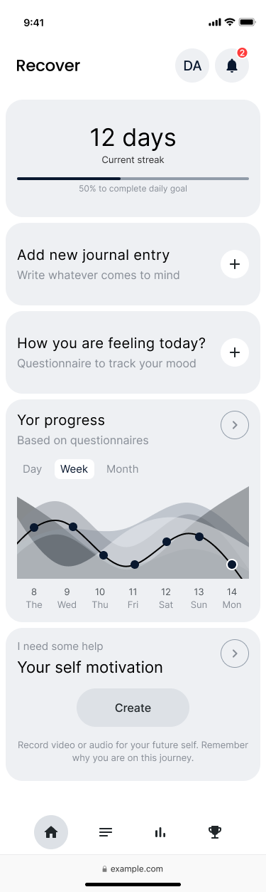
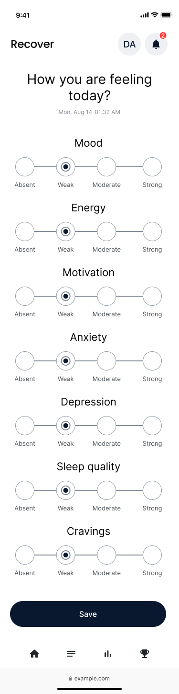
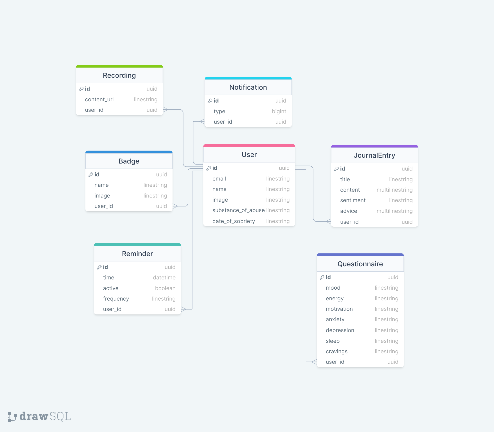

# Recover

## Overview

- An AI-assisted mood tracker to help you move past addiction

### Problem

- It is difficult to change a habit, let alone one that has crossed over into addiction.
- Building self-awareness and being equipped to deal with cravings are crucial.
- Tracking, nudging, and gamification are helpful in sustainably changing behaviour.
- Addiction is a large, global problem that negatively impacts lives in many ways.

### User Profile

- As addiction can impact anyone, the app should be as inclusive as possible. The UI/UX should reflect this.
- I expect different features (see feature list below) to be used differently. Journalling might be more suited to tablet/desktop, while completing a mood questionnaire is suited to mobile.
- Building a React Native counterpart app after the bootcamp would be a natural extension.

### Features

As a user, I want to:

- Write journal entries
- Receive feedback/analysis based on my journal entries with behavioural recommendations
- Regularly complete questionnaires to track and visualise my mental state over time
- Record videos and voice notes as promises to my future self. These should be quickly accessible for when cravings hit!
- Receive gamified/positive reinforcement when I reach abstinence milestones.

### Tech Stack

- TypeScript
- React
- Next.js
- TailwindCSS
- NextAuth.js
- Prisma ORM
- PlanetScale
- Vercel

### APIs

- OpenAI's API will generate the behavioural recommendations based on the user's journal entries.

## Implementation

### Sitemap

- Auth
  - Sign up
  - Sign in
- On boarding
  - Collect basic data: name, substance of abuse, date of sobriety
  - set up reminders to journal/complete questionnaire
- Navigation between dashboard, journal, visualisations, and achievements pages
- Dashboard
  - Display current length of sobriety
  - CTA to start a new journal entry
  - CTA to fill out a questionnaire
  - Summary + link to data visualisations based on your questionnaires over time
  - Link to your 'SOS' package – media you've recorded to consume when cravings hit.
- Journal page
  - list of journal entries
    - individual journal entry page with section for AI analysis + advice
- Visualisations page
- Achievements / badges page with badges awarded for various milestones (e.g. 1 month, 3 months, 1 year etc.)

### Mockups




### Endpoints

List endpoints that your server will implement, including HTTP methods, parameters, and example responses.

#### Auth

**GET /auth** and **POST /auth**

Handles authentication using NextAuth.js.

#### User

**GET /user**

- Returns the currently logged in user

**PATCH /user**

- Updates the currently logged in user

**DELETE /user**

- Deletes the currently logged in user

> Note: the Prisma adapter for NextAuth handles user creation.

#### Reminder

**GET /reminder**

- Returns a list of reminders

**GET /reminder/:id**

- Returns a reminder by id

**POST /reminder**

- Creates a new reminder

**PATCH /reminder/:id**

- Updates a reminder

**DELETE /reminder/:id**

- Deletes a reminder

#### Journal

**GET /journal**

- Returns a list of journal entries

**GET /journal/:id**

- Returns a journal entry by id

**POST /journal**

- Creates a new journal entry

**PATCH /journal/:id**

- Updates a journal entry

**DELETE /journal/:id**

- Deletes a journal entry

#### Questionnaire

**GET /questionnaire**

- Returns a list of questionnaires

**GET /questionnaire/:id**

- Returns a questionnaire by id

**POST /questionnaire**

- Creates a new questionnaire

**PATCH /questionnaire/:id**

- Updates a questionnaire

**DELETE /questionnaire/:id**

- Deletes a questionnaire

#### OpenAI Completion

**POST /completion**

Initialises a streaming text response from the OpenAI API. The response gets sent to the client in chunks as they are generated. For example:

```json
[
  {
    "content": "hello, I'm not sleeping well",
    "role": "user",
    "createdAt": "2023-08-21T13:33:44.706Z",
    "id": "cSXjVGK"
  },
  {
    "id": "Pq1NY7n",
    "createdAt": "2023-08-21T13:33:45.838Z",
    "content": "<h2 class=\"mb-3 text-2xl font-semibold\">Analysis</h2>\n          <p class=\"mb-3 text-xl\">\n            Based on your journal entry, your mood has been categorised as\n            <span class=\"font-bold\">negative</span>.\n          </p>\n          <h3 class=\"mb-4 text-xl\">\n            Here are some tips that might help you improve your sleep quality\n          </h3>\n          <ul>\n            <li>\n              Create a relaxing bedtime routine and stick to it every night\n            </li>\n            <li>\n              Avoid caffeine and alcohol, especially in the evening\n           ",
    "role": "assistant"
  }
]
```

### Database



### Auth

- NextAuth.js
- Prisma adapter
- Passwordless via email magic link
- OAuth with the following providers:
  - Google
  - GitHub
  - Facebook (if time permits)
  - Twitter (if time permits)

## Roadmap

Scope your project as a sprint. Break down the tasks that will need to be completed and map out timeframes for implementation. Think about what you can reasonably complete before the due date. The more detail you provide, the easier it will be to build.

## Nice-to-haves

Your project will be marked based on what you committed to in the above document. Under nice-to-haves, you can list any additional features you may complete if you have extra time, or after finishing.

## TODO

- think about using middleware to protect routes
- Tailwind typography to style OpenAI response
- Recharts for data visualisation
